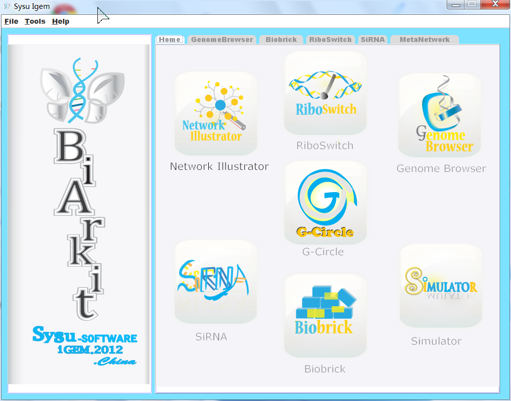
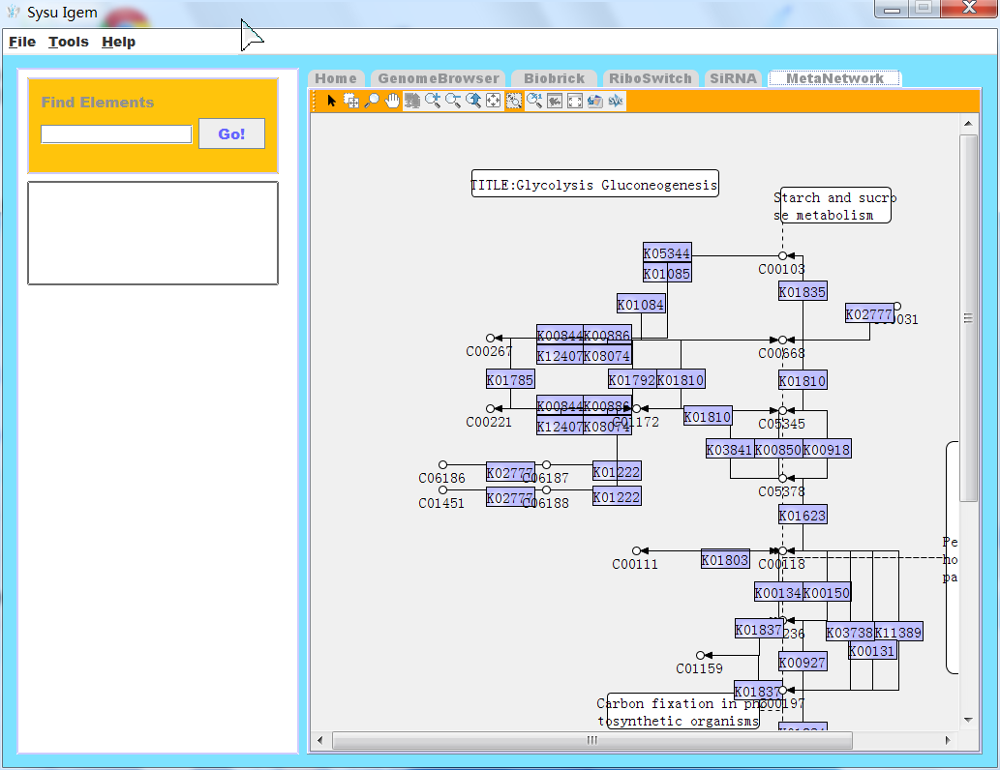
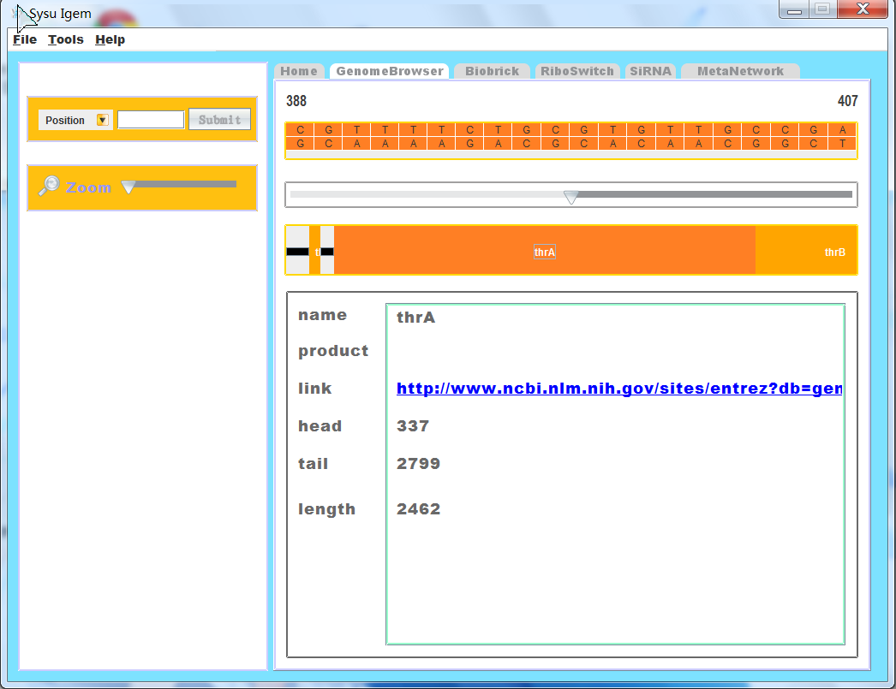
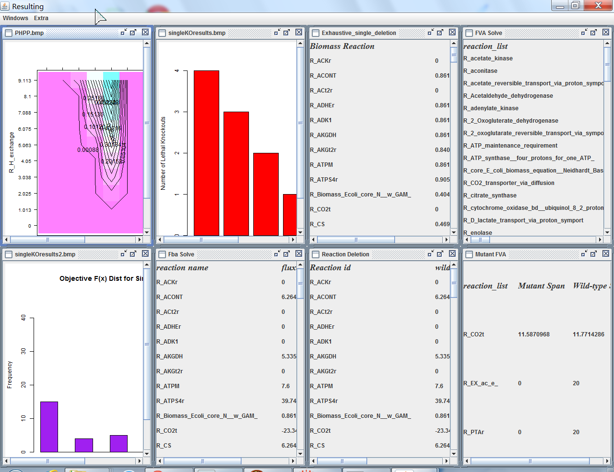

##Intro
Hi,I am a student now in cmu's ECE department,who will graduate in next May.I am interesting in programming.Hope to find a job about software engineering.

###website
My website is <http://guojiex.github.io>,it shows some graphs of my previous work(mostly data visualization),
and also some projects that I have done.
My linkedin file is in <https://www.linkedin.com/in/guojiex>.
###Programming 
####java swing
I have used java swing to develop a toolbox for biologists in the IGEM2012, which looks like:

As you can see, it is mostly data visualization and some implementation of algorithm.

####html and javascript
In the IGEM2013 competition, I mainly implemented some web charts using javascript and html, which look like:

Or like this:

I also took part in the encapsulation of database interface of server(we use flask as the server framework).
####biomedical image processing
Recently,I was doing a project to classify melanoma skin image automatically.In this project I segment the lesion part first and extract features from this part and classify using Neural network. At last I got an overall accuracy about 88%

###Future
I think in the rest of my life I will continue to do technical things because I am good at it and I have spent lot of time on it. And Expensify is a good platform for me to step into the real world. Since the task from Expensify is challenging, I can get improvement quickly and be better.

###How I heard about Expensify
By the cmu tartantrak platform.